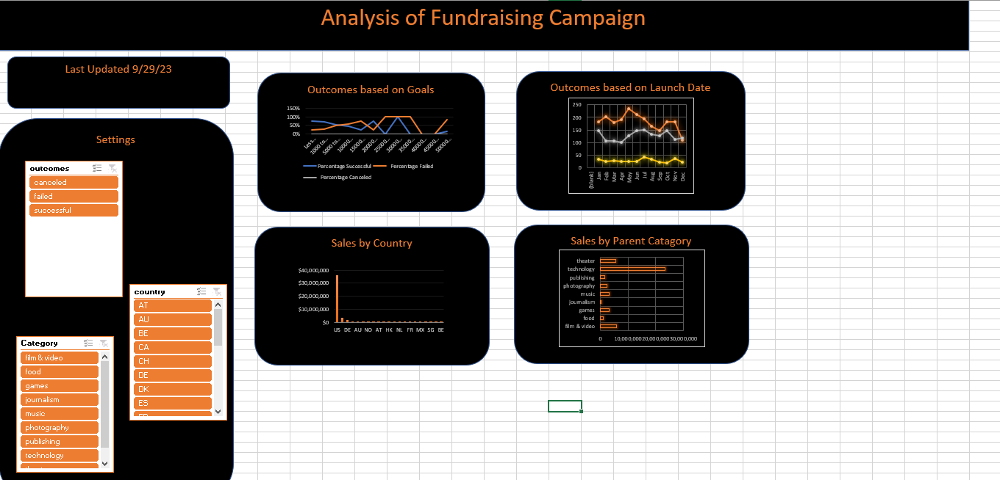
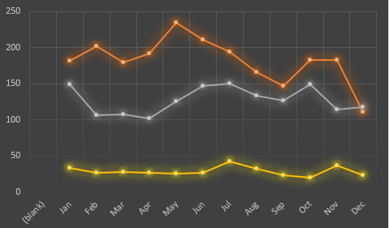

# Fundraising-Analysis
## Overview of Project

In this projected I made an interactive dashboard to help understand the funds made from the fundraising campaign. I included some slicers so that you can get the exact data you want. To use the slicer you simply click on what data you want and boom you get your data. 
### Purpose
To help understand the funds collected from the fundraising compaign.

## Analysis and Challenges
In this project shapes, codes, and pivot tabels were used in order to get the best outcome.  
### Analysis of Outcomes Based on Launch Date

This was a fun one to make it helped me organize the date and the money made the time frame of the Campaign. If you read the data you can see that in May thats when the most success was made. 
### Analysis of Outcomes Based on Goals

This one was very helpful to make because this helps you get percentages of the money that was earned and if the goal was reached. 
### Challenges and Difficulties Encountered
It was hard understanding the pivot table but I eventully got it and it helped me organize the funds.
## Results
The Result of this was a very well organized Dashboard that was interactive which allowed the data to be specific and percise. It was hard to get where I am with this project but now ive gained the ability to make more that are similar to the one I currently made. 
- What are two conclusions you can draw about the Outcomes based on Launch Date?
They are resourceful. They are organized. They help read and understand the Launch date money flow for people who need help analysing data. 
- What can you conclude about the Outcomes based on Goals?
They are resourceful. They are organized. They help read and understand the goal money flow for people who need help analysing data. 
- What are some limitations of this dataset?
It doesnt allow me to put in a map to make it interactive and cool. I wish they had more graphs to give a more detailed explanation of the data. 
- What are some other possible tables and/or graphs that we could create?
Here are some good examples tp indclude in your dashboard.

 
